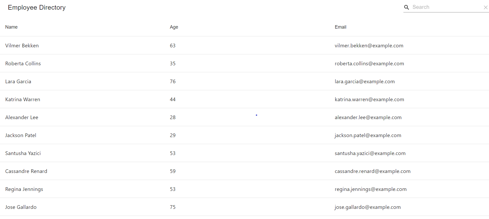

# Employee Directory 

## Description
This application houses the **Employee Directory** application which allows a user to view a directory full of random employees.  The application comes equipped with a search bar, an option to choose how many employees are shown, as well as sorting and pagination. It is hosted on Github Pages.  The random employees are a result of using the [Random User API](https://randomuser.me/).

#### Try It Out
Feel free to visit the app: [Employee Directory](https://davidesotomayor.github.io/employee-directory/)

## Table of Contents
* [Installation](#installation)
* [Usage](#usage)
* [Contributions](#contributions)
* [Test Instructions](#test-instructions)
* [License](#license)
* [Questions](#questions)

### Installation 
To install this program, it's as simple as cloning the files to your local machine.  Once in the directory, run:
```
npm i
```
This will install the modules/dependencies needed to run the program.
### Usage
To run this program, open the integrated terminal where this program is cloned to.  Run:
```
npm start
```
This will start the program.
### Contributions
The main purpose of this repository is to utilize the power of [React](https://reactjs.org/). If anyone is willing to contribute to the program, feel free to download it and create a separate branch and improve on it.  Also, feel free to get in touch with me through my email as well.

### Test Instructions
As for this repository, all the testing was done through localhost inspection tools.

### License
This project falls under the license: 
[](https://opensource.org/licenses/MIT)
    
### Questions
If you haven't already, and would like to visit my github profile, you can reach me at: https://github.com/DavidESotomayor

Please feel free to reach out to me for any questions, comments, or concerns at : david.elijah.sotomayor@gmail.com

Copyright &copy; David Sotomayor

### Sources
Here are the sources that lead to the creation of this application:
* [Random User API](https://randomuser.me/)
* [React](https://reactjs.org/)
* [Node.js](https://nodejs.org/en/)
* [npm / npm dependencies](https://www.npmjs.com/)
  * [@material-ui/core](https://www.npmjs.com/package/@material-ui/core)
  * [@material-ui/icons](https://www.npmjs.com/package/@material-ui/icons)
  * [@testing-library/jest-dom](https://www.npmjs.com/package/@testing-library/jest-dom)
  * [@testing-library/react](https://www.npmjs.com/package/@testing-library/react)
  * [@testing-library/user-event](https://www.npmjs.com/package/@testing-library/user-event)
  * [axios](https://www.npmjs.com/package/axios)
  * [gh-pages](https://www.npmjs.com/package/gh-pages)
  * [material-table](https://www.npmjs.com/package/material-table)
  * [react](https://www.npmjs.com/package/react)
  * [react-dom](https://www.npmjs.com/package/react-dom)
  * [react-scripts](https://www.npmjs.com/package/react-scripts)
  * [web-vitals](https://www.npmjs.com/package/web-vitals)